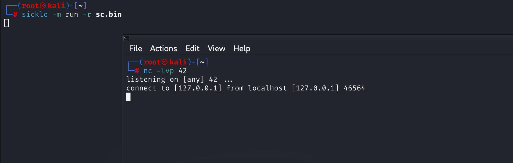

# Sickle


Sickle is a tool I originally developed to help me be more effective, in both developing and understanding shellcode. However, throughout the course of its development and usage It has evolved into a payload development framework. Although current modules are mostly aimed towards assembly, this tool is not limited to shellcode.

Currently sickle can assist in the following.

- Converting assembly instructions to machine code (opcodes)
- Executing bytecode, including generated payloads
- Formatting opcodes for a target language
- Bad character identification
- Linear disassembly
- Diffing

## Shellcode Generation

Sickle supports shellcode generation via the [Keystone Engine](https://www.keystone-engine.org/). Due to this being a newly added feature, payload support is limited. However, the goal is to add a basic reverse shell for each architecture and platform.


## Diffing

Sickle includes a "diffing" module initially designed for analyzing shellcode stubs. The original "asm" mode performs linear disassembly diffs at both the assembly language and opcode levels separately.


In addition, Sickle offers various modes for performing diffs, making it useful beyond shellcode development.


## Shellcode Execution

One common task you may often perform is testing your shellcode. This process typically involves the following steps:

1. Compile the assembly language code.
2. Extract the shellcode and format it appropriately for your chosen wrapper.
3. Compile the wrapper.
4. Execute the wrapper.

Although these steps may seem minor, they can become time-consuming when done repeatedly. Sickle simplifies the process by automatically wrapping shellcode for quick testing, and the "run" module currently supports both Windows and Unix systems.



## Disassembly

Sickle can also convert a binary file into extracted opcodes (shellcode) and then translate those into machine instructions (assembly). Note that this process only works with raw binary files and currently performs disassembly in a linear fashion.


In the example shown above the "disassemble" module disassembles a reverse shell designed by Stephen Fewer to assembly.

## Shellcode Extraction

Shellcode extraction was the first module, or rather, the core functionality for Sickle, as opcodes are interpreted differently depending on the wrapper used. JavaScript, for example, does not store and interpret shellcode in the same way as a C program would.


Perhaps the biggest inspiration for this was `msfvenom`.

## Bad Character Identification

Although less common in 64-bit exploits, there may be instances where an exploit restricts the use of certain characters. This is where the "pinpoint" module excels, as it directly identifies and highlights the assembly instructions responsible for the identified bad character(s).


# Module Based Design

Originally, this tool started as a single large script. However, as it evolved, I found myself needing to re-learn the code with each update. To address this, Sickle now follows a modular approach, allowing for new functionality to be added with minimal time spent re-learning the tool’s design.

```
$ sickle -l

  Shellcode                                                                        Description
  ---------                                                                        -----------
  windows/x64/kernel_token_stealer                                                 Kernel token stealing shellcode
  windows/x64/kernel_sysret                                                        Generic method of returning from kernel space to user space
  windows/x64/kernel_ace_edit                                                      Kernel shellcode to modify the _SECURITY_DESCRIPTOR of a process
  windows/x64/shell_reverse_tcp                                                    A TCP-based reverse shell over IPv4 that provides an interactive cmd.exe session
  windows/x86/kernel_token_stealer                                                 Kernel token stealing shellcode
  linux/aarch64/memfd_reflective_elf_tcp                                           TCP-based reflective ELF loader over IPV4 which executes an ELF from a remote server
  linux/aarch64/shell_reverse_tcp                                                  TCP-based reverse shell over IPV4 that provides an interactive /bin/sh session
  linux/x64/memfd_reflective_elf_tcp                                               TCP-based reflective ELF loader over IPV4 which executes an ELF from a remote server
  linux/x86/shell_reverse_tcp                                                      TCP-based reverse shell over IPV4 that provides an interactive /bin/sh session

  Modules             Description
  -------             -----------
  asm_shell           Interactive assembler and disassembler
  disassemble         Simple linear disassembler for multiple architectures
  diff                Bytecode diffing module for comparing two binaries (or shellcode)
  format              Converts bytecode into a respective format (activated anytime '-f' is used)
  run                 Wrapper used for executing bytecode (shellcode)
  badchar             Produces a set of all potential invalid characters for validation purposes
  pinpoint            Highlights opcodes within a disassembly to identify instructions responsible for bad characters

  Format              Description
  ------              -----------
  c                   Format bytecode for a C application
  java                Format bytecode for Java
  hex                 Format bytecode in hex
  num                 Format bytecode in num format
  powershell          Format bytecode for Powershell
  bash                Format bytecode for bash script (UNIX)
  nasm                Format bytecode for NASM
  raw                 Format bytecode to be written to stdout in raw form
  python3             Format bytecode for Python3
  cs                  Format bytecode for C#
  python              Format bytecode for Python
  uint8array          Format bytecode for Javascript as a Uint8Array directly
  hex_space           Format bytecode in hex, seperated by a space
  dword               Format bytecode in dword
  escaped             Format bytecode for one-liner hex escape paste
  javascript          Format bytecode for Javascript (Blob to send via XHR)
  perl                Format bytecode for Perl
  ruby                Format bytecode for Ruby
```

This approach allows each module the ability to generate detailed documentation for its functionality.

```
$ sickle -i -m run                            

Usage information for run

              Name: Shellcode Runner
            Module: run
      Architecture: Multi
          Platform: Multi
              Ring: 3

Author(s):
    wetw0rk

Tested against:
    Linux
    Windows

Description:
    
    Executes bytecode from a binary file (-r) or a payload module (-p) under the
    context of the currently running operating system and architecture. Meaning if
    you are running on AARCH64 bytecode will be interpreted as such and if your on
    x64 it will interpret it as x64 respectively.
    
Example:

    sickle.py -m run -r shellcode
```

This approach also includes documentation for shellcode stubs.

```
$ sickle -i -p linux/aarch64/shell_reverse_tcp

Usage information for linux/aarch64/shell_reverse_tcp

              Name: Linux (AARCH64 or ARM64) SH Reverse Shell
            Module: linux/aarch64/shell_reverse_tcp
      Architecture: aarch64
          Platform: linux
              Ring: 3

Author(s):
    wetw0rk

Tested against:
    Debian 14.2.0-6

Argument Information

  Argument Name        Argument Description                               Optional
  -------------        --------------------                               --------
  LHOST                Listener host to receive the callback              no
  LPORT                Listening port on listener host                    yes

Description:
    
    TCP-based reverse shell over IPV4 that provides an interactive /bin/sh
    session. Since this payload is not staged, there is no need for anything
    more than a Netcat listener.
    
Example:

    src/sickle.py -p linux/aarch64/shell_reverse_tcp LHOST=127.0.0.1 LPORT=1337 -f c
```
